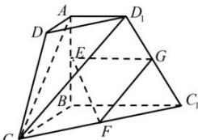
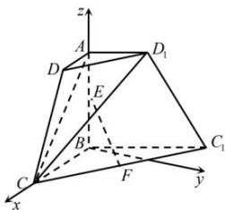

> [!faq]- 全练一本通解析
> **【答案】** （1）证明见解析（2） $\frac{\sqrt{2}}{2}$
>
> **【解析】**
> （1）证明：设 $D_{1}C_{1}$ 中点为 $G$ ，连接FG,EG，
> 
> ∵ FG 为 $\triangle CC_{1}D_{1}$ 中位线， $FG\parallel CD_{1}$ ，
> 又 $CD_{1}\subset$ 平面 $CD_{1}A$ ， $FG\not\subset$ 平面 $CD_{1}A$ ，
> ∴ FG// 平面 $CD_{1}A$ ，
> ∵ EG 为梯形 $ABC_{1}D_{1}$ 中位线， $EG\parallel AD_{1}$ ，
> 又 $AD_{1}\subset$ 平面 $CD_{1}A$ ， $EG\not\subset$ 平面 $CD_{1}A$ ，
> ∴ EG// 平面 $CD_{1}A$ ，
> ∵ $EG \cap FG = G$ ， $FG \subset$ 平面 EFG， $EG \subset$ 平面 EFG，
> ∴ 平面 EFG// 平面 $CD_{1}A$ ，
> ∵ EF ⊂ 平面 EFG，
> ∴ EF// 平面 $CD_{1}A$ .
> （2）以 $B$ 为原点，以 $BC, BA$ 所在直线为 $x, z$ 轴，以垂直于平面 $ABCD$ 的直线为 $z$ 轴，建立如图空间直角坐标系， $\because \angle DAD_{1} = \angle CBC_{1} = \theta (0 < \theta < \pi)$ ，不妨设 $AB = BC = 2AD = 2$ ， $\therefore B(0,0,0), C(2,0,0), A(0,0,2)$ ，则 $C_{1}\left(2\sin \left(\theta - \frac{\pi}{2}\right), 2\cos \left(\theta - \frac{\pi}{2}\right), 0\right), D_{1}\left(\sin \left(\theta - \frac{\pi}{2}\right), \cos \left(\theta - \frac{\pi}{2}\right), 2\right)$ ， $\therefore C_{1}(2\cos \theta, 2\sin \theta, 0), D_{1}(\cos \theta, \sin \theta, 2)$ ，则 $\overrightarrow{BA} = (0,0,2), \overrightarrow{BD_{1}} = (\cos \theta, \sin \theta, 2), \overrightarrow{CA} = (-2,0,2), \overrightarrow{CD_{1}} = (\cos \theta - 2, \sin \theta, 2)$ ，设平面 $AD_{1}C_{1}$ 的法向量为 $\overrightarrow{n_{1}} = (x_{1}, y_{1}, z_{1})$ ， $\therefore \left\{ \begin{array}{l} \overrightarrow{BA} \cdot \overrightarrow{n_{1}} = 0 \\ \overrightarrow{BD_{1}} \cdot \overrightarrow{n_{1}} = 0 \end{array} \right.$ ，即 $\left\{ \begin{array}{l} 2z_{1} = 0 \\ x_{1}\cos \theta + y_{1}\sin \theta + 2z_{1} = 0 \end{array} \right.$ ，不妨取 $x_{1} = -\sin \theta$ ， $\therefore \overrightarrow{n_{1}} = (-\sin \theta, \cos \theta, 0)$ ，设平面 $AD_{1}C$ 的法向量为 $\overrightarrow{n_{2}} = (x_{2}, y_{2}, z_{2})$ ， $\therefore \left\{ \begin{array}{l} \overrightarrow{CA} \cdot \overrightarrow{n_{2}} = 0 \\ \overrightarrow{CD_{1}} \cdot \overrightarrow{n_{2}} = 0 \end{array} \right.$ ，即 $\left\{ \begin{array}{l} -2x_{2} + 2z_{2} = 0 \\ x_{2}(\cos \theta - 2) + y_{2}\sin \theta + 2z_{2} = 0 \end{array} \right.$ ，不妨取 $x_{2} = 1$ ，则 $\overrightarrow{n_{2}} = (1, -\frac{\cos \theta}{\sin \theta}, 1)$ ， $\therefore \cos <\overrightarrow{n_{1}},\overrightarrow{n_{2}} > = \frac{-\sin\theta - \frac{\cos^{2}\theta}{\sin\theta}}{\sqrt{1 + (\frac{\cos\theta}{\sin\theta})^{2} + 1}} = -\frac{1}{\sqrt{1 + \sin^{2}\theta}}$ ，设二面角 $C - AD_{1} - C_{1}$ 平面角为 $\alpha$ ，由图可知 $\alpha$ 为锐角， $\therefore \cos\alpha = \frac{1}{\sqrt{1 + \sin^{2}\theta}}$ ， $\therefore \theta = \frac{\pi}{2}$ 时，二面角 $C - AD_{1} - C_{1}$ 的余弦最小值为 $\frac{\sqrt{2}}{2}$ .
> 
