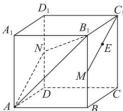

<!-- question-source:start -->
【14】（2024·浙江宁波高二上期中）如图,棱长为1的正方体 $ABCD-A_{1}B_{1}C_{1}D_{1}$ ，中 M, N 点，分别是线段 $BB_{1}, DD_{1}$ 的中点，记 E 是线段 $MC_{1}$ 的中点，则点 E 到面 $ANB_{1}$ 的距离为（）

A. $\frac{2}{3}$ B. $\frac{\sqrt{3}}{3}$ C. $\frac{\sqrt{2}}{3}$ D. $\frac{1}{3}$
<!-- question-source:end -->

![[Q00005528A1]]
