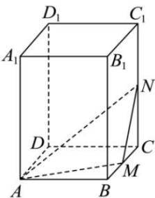

<!-- question-source:start -->
【17】在如图所示的直四棱柱 $ABCD - A_{1}B_{1}C_{1}D_{1}$ 中，底面 ABCD 是正方形， $AB = 2, AA_{1} = 3, M$ 是 BC 的中点，点 N 是棱 $CC_{1}$ 上的一个动点，求点 $A_{1}$ 到平面 AMN 的距离的最小值.

<!-- question-source:end -->

![[Q00005531A1]]
