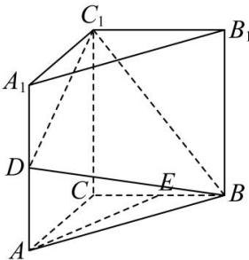

<!-- question-source:start -->
【38】直三棱柱 $ABC-A_{1}B_{1}C_{1}$ 中, D, E 分别是 $AA_{1}$ , BC 的中点, AC = BC = 1, $AA_{1} = 1$ , $\angle BCA = 90^{\circ}$ .
（1）求点 E 到平面 $C_{1}BD$ 的距离；
（2）取 $A_{1}B_{1}$ 靠近 $B_{1}$ 的三等分点 P，问线段 $CC_{1}$ 上是否存在点 Q，满足 $PQ \perp$ 面 $BDC_{1}$ ，若有，求出点 Q 的位置，若没有，说明理由.

<!-- question-source:end -->

![[Q00005645A1]]
