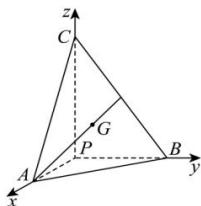

> [!faq]- 全练一本通解析
> **【答案】** $\frac{\sqrt{221}}{17}$
>
> **【解析】**
> 如图所示:以 PA,PB,PC 为 x,y,z 轴建立空间直角坐标系,
> 则 $P(0,0,0)$ , $A(1,0,0)$ , $B(0,2,0)$ , $C(0,0,3)$ , 则 $G\left(\frac{1}{3},\frac{2}{3},1\right)$ ,
> 
> $\overrightarrow{PA} = (1,0,0), \overrightarrow{AG} = \left(-\frac{2}{3}, \frac{2}{3}, 1\right)$ 故 $\overrightarrow{PA}$ 在 $\overrightarrow{AG}$ 的投影为 $\frac{\overrightarrow{PA} \cdot \overrightarrow{AG}}{|\overrightarrow{AG}|} = \frac{-\frac{2}{3}}{\sqrt{\left(-\frac{2}{3}\right)^2 + \left(\frac{2}{3}\right)^2 + 1}} = -\frac{2\sqrt{17}}{17}$ ，点 $P$ 到线 $AG$ 的距离为 $\sqrt{\overrightarrow{PA}^2 - \left(\frac{\overrightarrow{PA} \cdot \overrightarrow{AG}}{|\overrightarrow{AG}|}\right)^2} \sqrt{1 - \left(\frac{2\sqrt{17}}{17}\right)^2} = \frac{\sqrt{221}}{17}$ .
