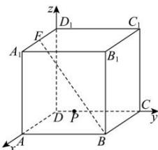

> [!faq]- 全练一本通解析
> **【答案】** $\frac{4\sqrt{5}}{5}$
>
> **【解析】**
> 在棱长为2的正方体 $ABCD - A_1B_1C_1D_1$ 中，以 $DA, DC, DD_1$ 分别为 $x, y, z$ 轴建立空间直角坐标系，则有 $B(2,2,0), F(1,0,2)$ ，则 $\overrightarrow{FB} = (1,2,-2)$ ，设点 $P(0,y,0), y \in [0,2], \overrightarrow{BP} = (-2,y-2,0)$ ，则点 $P$ 到直线 $BF$ 的距离 $d = \sqrt{|\overrightarrow{BP}|^2 - \left(\frac{\overrightarrow{BP} \cdot \overrightarrow{FB}}{|\overrightarrow{FB}|}\right)^2} = \sqrt{(y^2 - 4y + 8) - \left(\frac{2y - 6}{3}\right)^2}$ $= \sqrt{\frac{5}{9}\left(y - \frac{6}{5}\right)^2 + \frac{16}{5}} \geq \frac{4\sqrt{5}}{5}$ ，当且仅当 $y = \frac{6}{5}$ 时取等号，则点 $P$ 到直线 $BF$ 的距离的最小值为 $\frac{4\sqrt{5}}{5}$ .
> 
