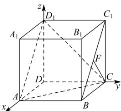

> [!faq]- 全练一本通解析
> **【答案】** A
>
> **【解析】**
> 解析:由题意以 D 为原点, DA, DC, $DD_{1}$ 所在直线分别为 x, y, z 轴所在直线建立如图所示的空间直角坐标系:
> 
> 所以 $A(1,0,0), C(0,1,0), D_{1}(0,0,1), B(1,1,0), C_{1}(0,1,1), F\left(\frac{1}{2},1,\frac{1}{2}\right)$ ,
> 所以 $\overrightarrow{D_{1}A}=(1,0,-1),\overrightarrow{D_{1}C}=(0,1,-1),\overrightarrow{CF}=\left(\frac{1}{2},0,\frac{1}{2}\right)$ 不妨设平面 $ACD_{1}$ 的法向量为 $\vec{n}=(x,y,z)$ ，
> 则 $\left\{\begin{aligned}&x-z=0\\ &y-z=0\end{aligned}\right.$ ，令 z=1，解得 x=y=1，即取平面 $ACD_{1}$ 的法向量为 $\vec{n}=(1,1,1)$ ，所以点 F 到平面 $ACD_{1}$ 的距离为 $d=\frac{\left|\overrightarrow{CF}\cdot\vec{n}\right|}{\left|\vec{n}\right|}=\frac{1}{\sqrt{3}}=\frac{\sqrt{3}}{3}$ .
>
> 故选 **A**.
