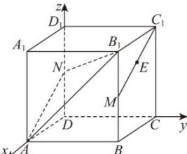

> [!faq]- 全练一本通解析
> **【答案】** D
>
> **【解析】**
> 解析:如图,以 D 点为坐标原点,DA 所在的直线为 x 轴,DC 所在的直线为 y 轴, $DD_{1}$ 所在的直线为 z 轴,建立空间直角坐标系.
> 
> 则 $A(1,0,0)$ , $B_{1}(1,1,1)$ , $C_{1}(0,1,1)$ , $N\left(0,0,\frac{1}{2}\right)$ , $M\left(1,1,\frac{1}{2}\right)$ , $\overrightarrow{MC_{1}}=\left(-1,0,\frac{1}{2}\right),\overrightarrow{AN}=\left(-1,0,\frac{1}{2}\right),\overrightarrow{AB_{1}}=(0,1,1),\overrightarrow{C_{1}B_{1}}=(1,0,0)$ 设平面 $ANB_{1}$ 的法向量为 $\vec{n}=(x,y,z)$ ,
> 则 $\begin{cases}\vec{n}\cdot\overrightarrow{AN}=-x+\frac{1}{2}z=0\\ \vec{n}\cdot\overrightarrow{AB_{1}}=y+z=0\end{cases}$ ，令 z=2，则 $\vec{n}=(1,-2,2)$ ，
> 因为 $\overrightarrow{MC_{1}}\cdot\vec{n}=\left(-1,0,\frac{1}{2}\right)\cdot(1,-2,2)=-1+1=0$ 所以 $\overrightarrow{MC_{1}}\perp\vec{n}$ ，又 $MC_{1}\not\subset$ 平面 $ANB_{1}$ ，所以 $MC_{1}//$ 面 $ANB_{1}$ ，故 E 与 $C_{1}$ 到平面 $ANB_{1}$ 的距离相等，
> 设点 $C_{1}$ 到平面 $ANB_{1}$ 的距离为 d，
> 则 $d=\frac{\left|\vec{n}\cdot\overline{C_{1}B_{1}}\right|}{\left|\vec{n}\right|}=\frac{1}{\sqrt{1^{2}+2^{2}+2^{2}}}=\frac{1}{3}$ ，故点 E 到面 $ANB_{1}$ 的距离为 $\frac{1}{3}$ .
>
> 故选 **D**
