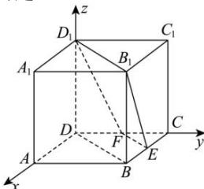

> [!faq]- 全练一本通解析
> **【答案】** D
>
> **【解析】**
> 解析:如图建立空间直角坐标系,则 $D(0,0,0),B(1,1,0),C(0,1,0),E(\frac{1}{2},1,0),F\left(0,\frac{1}{2},0\right)$ , $B_{1}(1,1,1),D_{1}(0,0,1)$ ,所以 $\overrightarrow{EB} = (\frac{1}{2},0,0),\overline{B_1D_1} = (-1, - 1,0),\overline{B_1E} = (-\frac{1}{2},0, - 1)$ ，设平面 $EFD_{1}B_{1}$ 的法向量为 $\vec{n} = (x,y,z)$ ，则 $\left\{ \begin{array}{l}\vec{n}\cdot \overline{B_1D_1} = -x - y = 0\\ \vec{n}\cdot \overline{B_1E} = -\frac{1}{2} x - z = 0 \end{array} \right.$ ，令 $z = 1$ ，则 $\vec{n} = (-2,2,1)$ ，因为 $BD / / B_1D_1$ ， $BD\not\subset$ 平面 $EFD_{1}B_{1}$ ， $B_{1}D_{1}\subset$ 平面 $EFD_{1}B_{1}$ 所以 $BD / /$ 平面 $EFD_{1}B_{1}$ ，所以直线 $BD$ 到平面 $EFD_{1}B_{1}$ 的距离即为点 $B$ 到平面 $EFD_{1}B_{1}$ 的距离，所以直线 $BD$ 到平面 $EFD_{1}B_{1}$ 的距离为 $d = \left|\frac{\overrightarrow{EB}\cdot\vec{n}}{\left|\vec{n}\right|}\right| = \left|\frac{\frac{1}{2}\times(-2)}{\sqrt{2^2 + 2^2 + 1}}\right| = \frac{1}{3}$ 故选：D.
> 
