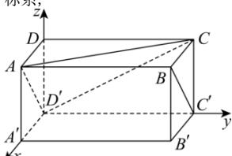

> [!faq]- 全练一本通解析
> **【答案】** $\frac{2}{3}$
>
> **【解析】**
> 如图, 分别以 $D'A', D'C', D'D$ 所在直线为 x, y, z 轴建立空间直角坐标系,
> 
> 则 $D'(0,0,0)A(1,0,1),C(0,2,1),B'(1,2,0)$ .
> 所以 $\overrightarrow{D'A}=(1,0,1),\overrightarrow{D'C}=(0,2,1)$ .
> 设平面 $D'AC$ 的法向量为 $\vec{n}=(u,v,w)$ ,
> 则 $\left\{\begin{aligned}\vec{n}&\perp\overline{D'A}\\ \vec{n}&\perp\overline{D'C}\end{aligned}\right.\Rightarrow\left\{\begin{aligned}\vec{n}&\cdot\overline{D'A}=0\\ \vec{n}&\cdot\overline{D'C}=0\end{aligned}\right.\Rightarrow\left\{\begin{aligned}u+w=0\\ 2v+w=0\end{aligned}\right.$ 取 $v=1\Rightarrow u=2,w=-2$ 从而得到平面 $D'AC$ 的一个法向量为 $\vec{n}=(2,1,-2)$ .
> 因为 $B(1,2,1),C'(0,2,0)\Rightarrow\overline{BC'}=(-1,0,-1)$ 又 $\overrightarrow{AD'}=(-1,0,-1)$ 所以 $\overrightarrow{BC'}=\overrightarrow{AD'}$ ，所以 $BC''//AD'$ 又 $BC'\not\subset$ 平面 $D'AC, AD'\subset$ 平面 $D'AC$ 从而 $BC''//平面 D'AC$ 所以直线 $BC'$ 到平面 $D'AC$ 的距离即为点 $C'$ 到平面 $D'AC$ 的距离.
> 因为 $\overrightarrow{C'C}=(0,0,1)$ ，平面 $D'AC$ 的法向量 $\vec{n}=(2,1,-2)$ 所以直线 $BC'$ 到平面 $D'AC$ 的距离为： $d=\frac{\left|\vec{n}\cdot\overrightarrow{C'C}\right|}{\left|\vec{n}\right|}=\frac{\left|2\times0+1\times0+(-2)\times1\right|}{\sqrt{2^{2}+1^{2}+(-2)^{2}}}=\frac{2}{3}$
