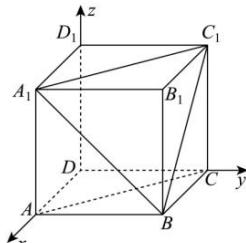

> [!faq]- 全练一本通解析
> **【答案】** $\frac{\sqrt{3}}{3}$
>
> **【解析】**
> 以 D 为原点，DA，DC， $DD_{1}$ 所在直线分别为 x 轴、y 轴、z 轴，建立如图所示的空间直角坐标系，
> 
> 则 $A(1,0,0)$ ， $A_{1}(1,0,1)$ ， $C_1(0,1,1)$ ， $C(0,1,0)$ ， $B(1,1,0)$
> 所以 $\overrightarrow{A_{1}C_{1}}=(-1,1,0)$ ， $\overrightarrow{BC_{1}}=(-1,0,1)$ ， $\overrightarrow{AB}=(0,1,0)$ ， $\overrightarrow{AC}=(-1,1,0)$ 。
> 设平面 $A_{1}BC_{1}$ 的法向量为 $\vec{n}=(x,y,z)$ ，
> 则 $\left\{\begin{aligned}\vec{n}\cdot\overrightarrow{A_{1}C_{1}}&=0\\ \vec{n}\cdot\overrightarrow{BC_{1}}&=0\end{aligned}\right.$ ，取 x=1，则 y=1，z=1，
> 所以 $\vec{n}=(1,1,1)$ 为平面 $A_{1}BC_{1}$ 的一个法向量，
> 所以点 A 到平面 $A_{1}BC_{1}$ 的距离为 $\frac{\left|\overrightarrow{AB}\cdot\vec{n}\right|}{\left|\vec{n}\right|}=\frac{1}{\sqrt{3}}=\frac{\sqrt{3}}{3}$ .
> 又 $\overrightarrow{AC}\cdot\vec{n}=0$ ，所以 $\overrightarrow{AC}\perp\vec{n}$ .
> 又 $AC \not\subsetneq$ 平面 $A_{1}BC_{1}$ ，所以 $AC \parallel$ 平面 $A_{1}BC_{1}$ ，
> 故点 A 到平面 $A_{1}BC_{1}$ 的距离等于直线 AC 到平面 $A_{1}BC_{1}$ 的距离为 $\frac{\sqrt{3}}{3}$ .
