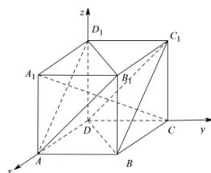

> [!faq]- 全练一本通解析
> **【答案】** $\frac{\sqrt{3}}{3}$
>
> **【解析】**
> 由正方体的性质： $AB_{1} // DC_{1}$ ， $D_{1}B_{1} // DB$ ， $AB_{1} \cap D_{1}B_{1} = B_{1}$ ， $DC_{1} \cap DB = D$ ，且 $AB_{1} \subset$ 平面 $AB_{1}D_{1}$ ， $D_{1}B_{1} \subset$ 平面 $AB_{1}D_{1}$ ， $DC_{1} \subset$ 平面 $BDC_{1}$ ， $DB \subset$ 平面 $BDC_{1}$ ，所以平面 $AB_{1}D_{1} //$ 平面 $BDC_{1}$ ，则两平面间的距离可转化为点 $B$ 到平面 $AB_{1}D_{1}$ 的距离。以 $D$ 为坐标原点， $DA, DC, DD_{1}$ 所在的直线分别为 $x, y, z$ 轴建立空间直角坐标系，如图所示：
> 
> 由正方体的棱长为 1, 所以 $A(1,0,0)$ , $B(1,1,0)$ , $A_{1}(1,0,1)$ , $C(0,1,0)$ , $B_{1}(1,1,1)$ , $D_{1}(0,0,1)$
> 所以 $\overrightarrow{CA_{1}}=(1,-1,1)$ ， $\overrightarrow{BA}=(0,-1,0)$ ， $\overrightarrow{AB_{1}}=\left(0,1,1\right)$ ， $\overline{B_{1}D_{1}}=\left(-1,-1,0\right)$ .
> 连接 $A_{1}C$ 由 $\overrightarrow{CA_{1}}\cdot\overrightarrow{AB_{1}}=\left(1,-1,1\right)\cdot\left(0,1,1\right)=1\times0+\left(-1\right)\times1+1\times1=0$ $\overrightarrow{CA_{1}}\cdot\overrightarrow{B_{1}D_{1}}=\left(1,-1,1\right)\cdot\left(-1,-1,0\right)=1\times\left(-1\right)+\left(-1\right)\times\left(-1\right)+1\times0=0$ 所以 $\overrightarrow{CA_{1}}\perp\overrightarrow{AB_{1}}\Rightarrow CA_{1}\perp AB_{1},\overline{CA_{1}}\perp\overline{B_{1}D_{1}}\Rightarrow CA_{1}\perp B_{1}D_{1}$ 且 $AB_{1}\cap B_{1}D_{1}=B_{1}$ 可知 $CA_{1}\perp$ 平面 $AB_{1}D_{1}$ 得平面 $AB_{1}D_{1}$ 的一个法向量为 $\overrightarrow{CA_{1}}=\vec{n}=\left(1,-1,1\right)$ 则两平面间的距离： $d=\left|\frac{\overrightarrow{BA}\cdot\vec{n}}{\left|\vec{n}\right|}\right|=\left|\frac{0\times1+\left(-1\right)\times\left(-1\right)+0\times1}{\sqrt{1^{2}+\left(-1\right)^{2}+1^{2}}}\right|=\frac{1}{\sqrt{3}}=\frac{\sqrt{3}}{3}$
> $$
> \begin{array}{c} \frac {2}{3} \end{array}
> $$
