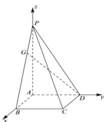

> [!faq]- 全练一本通解析
> **【答案】** A
>
> **【解析】**
> $\frac{3\sqrt{14}}{14}$
> 解析:如图,以点 A 为原点, $\overrightarrow{AB}, \overrightarrow{AD}, \overrightarrow{AP}$ 分别作为 x, y, z 轴正方向, 建立空间直角坐标系,
> 则 $B(3,0,0), C(3,3,0), D(0,3,0), P(0,0,6), G(1,0,4)$ .
> 所以 $\overrightarrow{DG}=(1,-3,4),\overrightarrow{PC}=(3,3,-6),\overrightarrow{DC}=(3,0,0)$ ,
> 设 $\vec{n}=(x,y,z)$ 为直线 PC 和 DG 的公垂线的方向向量，
> 则有 $\left\{\begin{aligned}\vec{n}&\cdot\overrightarrow{DG}=x-3y+4z=0\\ \vec{n}&\cdot\overrightarrow{PC}=3x+3y-6z=0\end{aligned}\right.$ ，可取 $\vec{n}=(1,3,2)$ 所以异面直线 PC 和 DG 的距离为 $\frac{\left|\overrightarrow{DC}\cdot\vec{n}\right|}{\left|\vec{n}\right|}=\frac{3}{\sqrt{14}}=\frac{3\sqrt{14}}{14}$ .
> 
>
> 故选 **A**.
