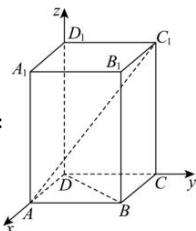

> [!faq]- 全练一本通解析
> **【答案】** $\frac{\sqrt{3}}{3}$
>
> **【解析】**
> 
> 因为点 E 和 F 分别是线段 $AC_{1}$ 与 BD 上的动点，则 EF 间最小距离即为异面直线 $AC_{1}$ 与 BD 间的距离，
> 建立如图所示空间直角坐标系，则 $D(0,0,0), B(1,1,0), A(1,0,0), C_{1}(0,1,2)$ ，
> 则 $\overrightarrow{DB}=(1,1,0),\overrightarrow{AC_{1}}=(-1,1,2)$ ， $\overrightarrow{AB}=(0,1,0)$ ，
> 设与异面直线 $AC_{1}$ 与 BD 都垂直的向量 $\vec{n}=(x,y,z)$ ，
> 则 $\left\{\begin{aligned}\vec{n}\cdot\overrightarrow{DB}&=x+y=0\\ \vec{n}\cdot\overrightarrow{AC_{1}}&=-x+y+z=0\end{aligned}\right.$ ，解得 $\left\{\begin{aligned}x&=z\\ x&=-y\end{aligned}\right.$ ，取 x=1，则 y=-1,z=1，
> 所以 $\vec{n}=(1,-1,1)$ ，则异面直线间的距离为 $\frac{\left|\vec{n}\cdot\overrightarrow{AB}\right|}{\left|\vec{n}\right|}=\frac{1}{\sqrt{3}}=\frac{\sqrt{3}}{3}$ .
> 即 EF 间最小距离为 $\frac{\sqrt{3}}{3}$ .
