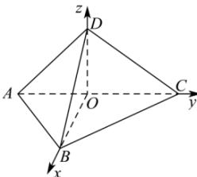

> [!faq]- 全练一本通解析
> **【答案】** $\frac{2\sqrt{6}}{3}$
>
> **【解析】**
> 取 AC 的中点 O, 连结 OB, OD, $OD \perp AC$ , $OB \perp AC$ 由条件可知, 平面 ACD ⊥ 平面 ABC, 且平面 ACD ∩ 平面 ABC = AC,
> $$
> O D \subset
> $$
> 
> 所以 $OD \perp$ 平面 ABC，
> 如图，以点 $O$ 为原点， $\overrightarrow{OB}, \overrightarrow{OC}, \overrightarrow{OD}$ 为 $x, y, z$ 轴的正方向，建立空间直角坐标系， $A(0, -\sqrt{2}, 0), B(\sqrt{2}, 0, 0), C(0, \sqrt{2}, 0), D(0, 0, \sqrt{2})$ ， $\overrightarrow{AD} = (0, \sqrt{2}, \sqrt{2}), \overrightarrow{BC} = (-\sqrt{2}, \sqrt{2}, 0), \overrightarrow{BD} = (-\sqrt{2}, 0, \sqrt{2})$ ，设与 $\overrightarrow{AD}, \overrightarrow{BC}$ 垂直的向量为 $\vec{n} = (x, y, z)$ ，则 $\left\{\frac{\overrightarrow{AD} \cdot \vec{n}}{\overrightarrow{BC} \cdot \vec{n}} = \sqrt{2}y + \sqrt{2}z = 0\right.$ ，令 $x = 1$ ，则 $y = 1, z = -1$ ，所以 $\vec{n} = (1, 1, -1)$ ，则异面直线 $AD$ 与 $BC$ 的距离为 $\left|\frac{\overrightarrow{BD} \cdot \vec{n}}{|\vec{n}|}\right| = \left|\frac{-\sqrt{2} - \sqrt{2}}{\sqrt{3}}\right| = \frac{2\sqrt{6}}{3}$ 。故答案为： $\frac{2\sqrt{6}}{3}$
