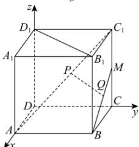

> [!faq]- 全练一本通解析
> **【答案】** $\frac{\sqrt{6}}{3}$
>
> **【解析】**
> 建立如图所示的空间直角坐标系， $A(2, 0, 0), C_1(0, 2, 2), B(2, 2, 0), M(0, 2, 1)$ ，则 $\overrightarrow{AC_1} = (-2, 2, 2), \overrightarrow{BM} = (-2, 0, 1)$ ，设 $\overrightarrow{AP} = x\overrightarrow{AC_1} = (-2x, 2x, 2x), \overrightarrow{BQ} = y\overrightarrow{BM} = (-2y, 0, y)$ ，故 $P(2 - 2x, 2x, 2x), Q(2 - 2y, 2, y), \overrightarrow{PQ} = (2x - 2y, 2 - 2x, y - 2x)$ ，由于直线 $AC_1$ ， $BM$ 为异面直线，要使 $PQ$ 的最小，则 $PQ$ 是 $AC_1$ ， $BM$ 的公垂线，故 $\left\{\frac{\overrightarrow{AC_1} \cdot \overrightarrow{PQ}}{\overrightarrow{BM} \cdot \overrightarrow{PQ}} = -2(2x - 2y) + 2(2 - 2x) + 2(y - 2x) = 0,\right.$ 解得 $x = \frac{5}{6}, y = 1$ ，
> 所以 $\overrightarrow{PQ}=\left(-\frac{1}{3},\frac{1}{3},-\frac{2}{3}\right)$ ,
> 故 $\left|\overrightarrow{PQ}\right|=\sqrt{\frac{1}{9}+\frac{1}{9}+\frac{4}{9}}=\frac{\sqrt{6}}{3}$ 故答案为： $\frac{\sqrt{6}}{3}$
> 
