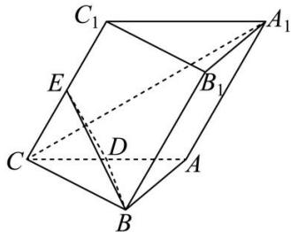

<!-- question-source:start -->
【34】如图, 三棱柱 $ABC - A_{1}B_{1}C_{1}$ 所有棱长均为 2, $\angle C_{1}CA = 60^{\circ}$ , 侧面 $ACC_{1}A_{1}$ 与底面 $ABC$ 垂直, $D$ 、 $E$ 分别是线段 $AC$ 、 $CC_{1}$ 的中点. (1) 求证: $A_{1}C \perp BE$ ; (2) 若点 $F$ 为棱 $B_{1}C_{1}$ 上靠近 $B_{1}$ 的三等分点, 求点 $F$ 到平面 $BDE$ 的距离.

<!-- question-source:end -->

![[Q00005548A1]]
