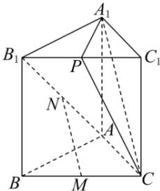

<!-- question-source:start -->
【32】(2024·黑龙江二模) 如图所示, 已知正三棱柱 $ABC - A_{1}B_{1}C_{1}$ 的侧棱长和底面边长均为 2, M 是 BC 的中点, N 是 $AB_{1}$ 的中点, P 是 $B_{1}C_{1}$ 的中点.
（1）证明：MN// 平面 $A_{1}CP$ ;
（2）求点 P 到直线 MN 的距离.

<!-- question-source:end -->

![[Q00005641A1]]
