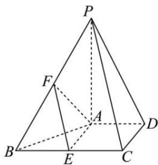

<!-- question-source:start -->
【33】（2024·吉林模拟预测）如图所示，在四棱锥P-ABCD中， $PA \perp$ 平面ABCD, $PB = PC = 2\sqrt{6}$ ， $PA = BC = 2AD = 2CD = 4$ , E为BC中点，点F在梭PB上（不包括端点）.
（1）证明：平面 AEF ⊥ 平面 PAD；
（2）若点 F 为 PB 的中点，求直线 EF 到平面 PCD 的距离.

<!-- question-source:end -->

![[Q00005642A1]]
