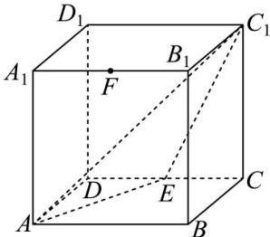

<!-- question-source:start -->
【36】（2024·广东汕尾高二上期末）如图，正方体 $ABCD-A_{1}B_{1}C_{1}D_{1}$ 的棱长为2，E为CD的中点，平面 $AEC_{1}$ 与棱 $A_{1}B_{1}$ 相交于点F.
（1）求点 $D_{1}$ 到平面 $AEC_{1}$ 的距离；
（2）求证：F 是 $A_{1}B_{1}$ 的中点.

<!-- question-source:end -->

![[Q00005643A1]]
