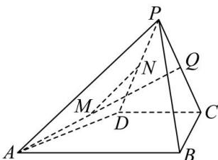

<!-- question-source:start -->
【39】（2024·湖南高三阶段练习）如图，在四棱锥P-ABCD中， $AB//CD$ ，AB=4，CD=2，BC=2，PC=PD=3，平面 $PCD\perp$ 平面ABCD， $PD\perp BC$ 。
（1）证明： $BC\perp$ 平面PCD；
（2）若点Q是线段PC的中点，M是直线AQ上的一点，N是直线PD上的一点，是否存在点M,N使得 $MN=\frac{2\sqrt{5}}{9}$ ?请说明理由.

<!-- question-source:end -->

![[Q00005646A1]]
