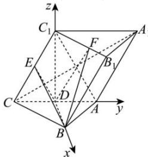

> [!faq]- 全练一本通解析
> **【答案】** （1）证明见解析（2） $\frac{5\sqrt{3}}{6}$
>
> **【解析】**
> (1)连接 $AC_{1}$ ，因为三棱柱 $ABC-A_{1}B_{1}C_{1}$ 所有棱长均为2，则 $\triangle ABC$ 为等边三角形，
> 因为D为AC中点，则 $BD\perp AC$ ，
> 因为平面 $ACC_{1}A_{1}\perp$ 平面ABC，平面 $ACC_{1}A_{1}\cap$ 平面ABC=AC， $BD\subset$ 平面ABC，
> 所以 $BD\perp$ 平面 $AA_{1}C_{1}C$ ，又 $A_{1}C\subset$ 平面 $AA_{1}C_{1}C$ ，可得 $BD\perp A_{1}C$ ，
> 由题设知四边形 $AA_{1}C_{1}C$ 为菱形，则 $A_{1}C\perp AC_{1}$ ，
> 因为D，E分别为AC， $CC_{1}$ 中点，则 $DE//AC_{1}$ ，可得 $A_{1}C\perp DE$ ，
> 又 $BD\cap DE=D$ ，BD， $DE\subset$ 平面BDE，所以 $A_{1}C\perp$ 平面BDE，
> 又 $BE\subset$ 平面BDE，所以 $A_{1}C\perp BE$ ；
> （2）连接 $C_{1}D$ ，因为 $CA=CC_{1}$ ， $\angle C_{1}CA=60^{\circ}$ ，所以 $\triangle ACC_{1}$ 为正三角形，
> 所以 $C_{1}D\perp AC$ 又侧面 $ACC_{1}A_{1}$ 与底面ABC垂直， $C_{1}D\subset$ 平面 $ACC_{1}A_{1}$ ，侧面 $ACC_{1}A_{1}\cap$ 底面ABC=AC，
> 所以 $C_{1}D \perp$ 平面 ABC，所以 DB，DA， $DC_{1}$ 两两垂直.
> 以 D 为坐标原点， $\overrightarrow{DB}$ ， $\overrightarrow{DA}$ ， $\overrightarrow{DC_{1}}$ 所在直线为 x，y，z 轴，建立如图所示空间直角坐标系，
> 
> 则 $D(0,0,0)$ ， $B(\sqrt{3},0,0)$ ， $C(0,-1,0)$ ， $C_{1}(0,0,\sqrt{3})$ ， $E\left(0,-\frac{1}{2},\frac{\sqrt{3}}{2}\right)$ ， $B_{1}\left(\sqrt{3},1,\sqrt{3}\right)$ ， $A_{1}\left(0,2,\sqrt{3}\right)$ 点 F 为棱 $B_{1}C_{1}$ 上靠近 $B_{1}$ 的三等分点，故 $F\left(\frac{2\sqrt{3}}{3},\frac{2}{3},\sqrt{3}\right)$ ，
> 可得 $\overrightarrow{DB}=\left(\sqrt{3},0,0\right),\overrightarrow{DE}=\left(0,-\frac{1}{2},\frac{\sqrt{3}}{2}\right),\overrightarrow{DF}=\left(\frac{2\sqrt{3}}{3},\frac{2}{3},\sqrt{3}\right)$ 设平面 BDE 的一个法向量为 $\vec{m}=(x,y,z)$ ，则 $\left\{\begin{aligned}\vec{m}\cdot\overrightarrow{DB}&=\sqrt{3}x=0\\\vec{m}\cdot\overrightarrow{DE}&=-\frac{1}{2}y+\frac{\sqrt{3}}{2}z=0\end{aligned}\right.$ 令 z=1，则 x=0， $y=\sqrt{3}$ ，可得 $\vec{m}=\left(0,\sqrt{3},1\right)$ 所以点 F 到平面 BDE 的距离为 $d=\frac{\left|\vec{m}\cdot\overrightarrow{DF}\right|}{\left|\vec{m}\right|}=\frac{\left|\frac{2\sqrt{3}}{3}+\sqrt{3}\right|}{\sqrt{\left(\sqrt{3}\right)^{2}+1^{2}}}=\frac{5\sqrt{3}}{6}$ ;
