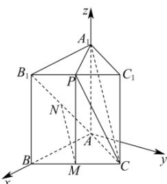

> [!faq]- 全练一本通解析
> **【答案】** （1）证明见解析（2） $\sqrt{2}$
>
> **【解析】**
> （1）由题意知， $AA_{1} \perp$ 平面 $ABC$ ， $\angle BAC = 60^{\circ}$ ，而 $AB \subset$ 平面 $ABC$ ，所以 $AA_{1} \perp AB$ ，在平面 $ABC$ 内过点 $A$ 作 $y$ 轴，使得 $AB \perp y$ 轴，建立如图空间直角坐标系 $A - xyz$ ，
> 则 $A(0,0,0), B(2,0,0), C(1,\sqrt{3},0), A_{1}(0,0,2), B_{1}(2,0,2)$ ，得 $M(\frac{3}{2}, \frac{\sqrt{3}}{2}, 0), N(1,0,1), P(\frac{3}{2}, \frac{\sqrt{3}}{2}, 2)$ ，
> 所以 $\overline{A_{1}C} = (1, \sqrt{3}, -2), \overline{A_{1}P} = (\frac{3}{2}, \frac{\sqrt{3}}{2}, 0), \overline{MN} = (-\frac{1}{2}, -\frac{\sqrt{3}}{2}, 1)$ ，设平面 $A_{1}CP$ 的一个法向量为 $\vec{n} = (x, y, z)$ ，
> 则 $\left\{ \begin{array}{l} \vec{n} \cdot \overrightarrow{A_{1}C} = x + \sqrt{3}y - 2z = 0 \\ \vec{n} \cdot \overrightarrow{A_{1}P} = \frac{3}{2}x + \frac{\sqrt{3}}{2}y = 0 \end{array} \right.$ ，令 $x = 1$ ，得 $y = -\sqrt{3}, z = -1$ ，所以 $\vec{n} = (1, -\sqrt{3}, -1)$ ，
> 所以 $\overline{MN} \cdot \vec{n} = -\frac{1}{2} \times 1 + (-\frac{\sqrt{3}}{2}) \times (-\sqrt{3}) + 1 \times (-1) = 0$ ，又 $MN$ 不在平面 $A_{1}CP$ 内即 $MN //$ 平面 $A_{1}CP$ ；
> （2）如图，连接 $PM$ ，由（1）得 $\overline{PM} = (0,0,-2)$ ，
> 则 $\overline{MN} \cdot \overrightarrow{PM} = -2$ ， $|\overrightarrow{MN}| = \sqrt{2}, |\overrightarrow{PM}| = 2$ ，
> 所以点 $P$ 到直线 $MN$ 的距离为 $d = \sqrt{\left|\overrightarrow{PM}\right|^2 - \left(\frac{\overrightarrow{MN} \cdot \overrightarrow{PM}}{|\overrightarrow{MN}|}\right)^2} = \sqrt{2}$ 。
> 
