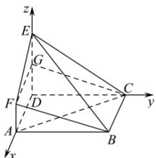

> [!faq]- 全练一本通解析
> **【答案】** （1）证明见解析（2）存在； $AP=\sqrt{2}$
>
> **【解析】**
> （1）证明：设点 G 是线段 DE 上靠近 D 的三等分点，连接 GF，GC.
> ∵ DE = 3AF = 3, ∴ AF = DG,
> 又∵ AF//DE, ∴ 四边形 AFGD 是平行四边形, ∴ FG = AD, FG//AD,
> 在正方形中 BC//AD, BC = AD, 所以 FG//BC, FG = BC,
> ∴ 四边形 FGCB 是平行四边形, 则 BF//GC, BF ≠ 平面 DEC, GC ⊂ 平面 DEC,
> ∴ BF// 平面 DEC;
> (2)∵ DE⊥平面 ABCD, DA⊥DC, ∴ 以 D 为原点, 建立如图所示的空间直角坐标系,
> 
> $A(4,0,0), B(4,4,0), C(0,4,0), F(4,0,1), E(0,0,3), \overrightarrow{AC} = (-4,4,0), \overrightarrow{EF} = (4,0,-2), \overrightarrow{EB} = (4,4,-3),$ 设 $P(x,y,z), \overrightarrow{AP} = \lambda \overrightarrow{AC}, 0 \leqslant \lambda \leqslant 1$ , 故 $P(4 - 4\lambda, 4\lambda, 0), \overrightarrow{BP} = (-4\lambda, 4\lambda - 4,0)$ 设平面 BEF 的法向量为 $\vec{n} = (x,y,z)$ , 则 $\left\{ \begin{array}{l} \vec{m} \cdot \overrightarrow{EF} = 0 \\ \vec{m} \cdot \overrightarrow{EB} = 0 \end{array} \right.$ , 即 $\left\{ \begin{array}{l} 4x - 2z = 0 \\ 4x + 4y - 3z = 0 \end{array} \right.$ , 令 $x = 1$ , 则 $\vec{n} = \left(1, \frac{1}{2}, 2\right)$ ,
> ∵点P到平面BEF的距离为 $\frac{5\sqrt{21}}{21}$ ，
> 所以 $\frac{\left|\vec{n}\cdot\overrightarrow{BP}\right|}{\left|\vec{n}\right|}=\frac{\left|-4\lambda+2\lambda-2\right|}{\sqrt{1+\frac{1}{4}+4}}=\frac{5\sqrt{21}}{21}$ ，解得 $\lambda=\frac{1}{4}$ 或 $-\frac{9}{4}$ （舍去），
> ∵ $AC = 4\sqrt{2}$ ，∴ $AP = \frac{1}{4}AC = \sqrt{2}$ ，∴当 $AP = \sqrt{2}$ 时，点 P 到平面 BEF 的距离为 $\frac{5\sqrt{21}}{21}$ .
