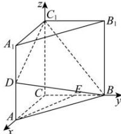

> [!faq]- 全练一本通解析
> **【答案】** （1） $\frac{1}{3}$ ; （2）存在，点 Q 为 $CC_{1}$ 靠近 C 的三等分点.
>
> **【解析】**
> （1）因为 ABC-A,B,C，为直三棱柱，则 $C_{1}C \perp$ 平面 ABC，且
> $$
> \angle B C A = 9 0 ^ {\circ}
> $$
> $$
> \overrightarrow {C C _ {1}}
> $$
> 
> 因为 $AC = BC = 1$ ， $AA_{1} = 1$ ，且 $D,E$ 分别是 $AA_{1}$ ，BC的中点，则 $C(0,0,0)$ ， $A(1,0,0)$ ， $C_1(0,0,1)$ ， $B(0,1,0)$ ， $D\left(1,0,\frac{1}{2}\right)$ ， $E\left(0,\frac{1}{2},0\right)$ 所以 $\overline{C_1B} = (0,1, - 1)$ ， $\overline{C_1D} = \left(1,0, - \frac{1}{2}\right)$ 设面 $C_1BD$ 的法向量为 $\vec{n} = (x,y,z)$ ，则 $\left\{ \begin{array}{l}\vec{n}\cdot \overline{C_1B} = y - z = 0\\ \vec{n}\cdot \overline{C_1D} = x - \frac{1}{2} z = 0 \end{array} \right.$ 取 $z = 2$ ，则面 $C_1BD$ 的一个法向量为 $\vec{n} = (1,2,2)$ 且 $\overline{EB} = \left(0,\frac{1}{2},0\right)$ ，则点 $E$ 到平面 $C_1BD$ 的距离 $d = \frac{\left|\overline{EB}\cdot\vec{n}\right|}{\left|\vec{n}\right|} = \frac{2\times\frac{1}{2}}{\sqrt{9}} = \frac{1}{3}.$ （2）假设线段 $CC_{1}$ 上存在点 $Q$ ，使 $PQ\bot$ 面 $BDC_{1}$ ，设 $Q(0,0,a)(0\leq a\leq 1)$ 因为 $P$ 是 $A_{1}B_{1}$ 靠近 $B_{1}$ 的三等分点，且 $A_{1}(1,0,1)$ ， $B_{1}(0,1,1)$ $\therefore \overline{A_1P} = \frac{2}{3}\overline{A_1B_1} = \left(-\frac{2}{3},\frac{2}{3},0\right),\therefore P\left(\frac{1}{3},\frac{2}{3},1\right)$ ，则 $\overline{PQ} = \left(-\frac{1}{3}, - \frac{2}{3},a - 1\right)$ 由（1）知：平面 $C_1BD$ 的一个法向量为 $\vec{n} = (1,2,2)$ 由于 $PQ\bot$ 面 $BDC_{1}$ ，所以 $\overline{PQ} / / \vec{n}$ ，则 $\frac{-\frac{1}{3}}{1} = \frac{-\frac{2}{3}}{2} = \frac{a - 1}{2},\therefore a = \frac{1}{3}$ 故存在点 $Q$ 满足 $PQ\bot$ 面 $BDC_{1}$ ，且点 $Q$ 为 $CC_{1}$ 靠近 $C$ 的三等分点.
