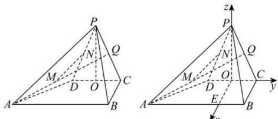

> [!faq]- 全练一本通解析
> **【答案】** （1）证明见解析（2）不存在，理由见解析
>
> **【解析】**
> （1）如图，取 CD 的中点 O，因为 PC = PD = 3，则 $PO \perp CD$ ，
> 因为平面 $PCD \perp$ 平面 ABCD，平面 $PCD \cap$ 平面 ABCD = CD， $PO \subset$ 平面 PCD，
> 所以 $PO \perp$ 平面 ABCD，
> 又 $BC \subset$ 平面 ABCD，
> 所以 $PO \perp BC$ ，又 $BC \perp PD$ ， $PO \subset$ 平面 PCD， $PD \subset$ 平面 PCD， $PD \cap PO = P$ 所以 $BC \perp$ 平面 PCD.
> 
> （2）因为 PC = PD = 3, O 为 CD 的中点, OC = 1, 所以 $PO=\sqrt{PC^{2}-OC^{2}}=2\sqrt{2}$ 过点 O 作 OE // BC 交 AB 于点 E，则由 BC ⊥ 平面 PCD， $CD \subset$ 平面 PCD，可得 $BC \perp CD$ ，
> 则以 O 为原点，OE，OC，OP 分别为 x 轴、y 轴、z 轴建立如图所示的
> 空间直角坐标系，
> 则 $O(0,0,0)$ , $A(2,-3,0)$ , $Q\left(0,\frac{1}{2},\sqrt{2}\right)$ , $D(0,-1,0)$ , $P(0,0,2\sqrt{2})$
> 所以 $\overrightarrow{AQ} = \left(-2, \frac{7}{2}, \sqrt{2}\right)$ , $\overrightarrow{DP} = (0, 1, 2\sqrt{2})$ , $\overrightarrow{AD} = (-2, 2, 0)$ ,
> 设与 $\overrightarrow{AQ}$ ， $\overrightarrow{DP}$ 都重直的向量为 $\vec{n}=(x,y,z)$
> $$
> \text {则} \left\{ \begin{array}{l l} {\vec {n} \cdot \overrightarrow {A Q} = - 2 x + \frac {7}{2} y + \sqrt {2} z = 0,} \\ {\vec {n} \cdot \overrightarrow {D P} = y + 2 \sqrt {2} z = 0,} \end{array} \right. \text {得} \left\{ \begin{array}{l l} x = \frac {3}{2} y, \\ z = - \frac {\sqrt {2}}{4} y, \end{array} \right.
> $$
> 令 $y = 4$ ，则 $\vec{n} = (6,4, - \sqrt{2})$
> 设直线 AQ 与直线 DP 的距离为 d,
> $$
> d = \left| \left| \overrightarrow {A D} \right| \cdot \cos \overrightarrow {A D}, \vec {n} \right| = \frac {\left| \overrightarrow {A D} \cdot \vec {n} \right|}{\left| \vec {n} \right|} = \frac {\left| - 1 2 + 8 \right|}{\sqrt {3 6 + 1 6 + 2}} = \frac {2 \sqrt {6}}{9} > \frac {2 \sqrt {5}}{9}
> $$
> 则不存在点 M 和 N 使得 $MN=\frac{2\sqrt{5}}{9}$
