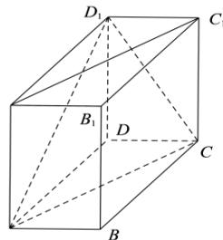

<!-- question-source:start -->
【10】如图, 在长方体 $ABCD - A_{1}B_{1}C_{1}D_{1}$ 中, AB = 2, AD = 6, $AA_{1} = 3$ , 建立适当的空间直角坐标系, 求下列平面的一个法向量:

$A_{1}$

(1) 平面 ABCD;
(2) 平面 $ACC_{1}A_{1}$ ;
(3) 平面 $ACD_{1}$ .
<!-- question-source:end -->

![[Q00005636A1]]
