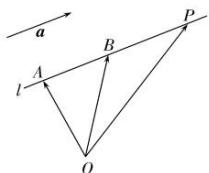

## 1. 直线的向量表示

点 A 是直线 l 上的一个点, $\vec{a}$ 是直线 l 的方向向量, 在直线 l 上取 $\overrightarrow{AB} = \vec{a}$ , 取定空间中的任意一点 O, 则点 P 在直线 l 上的充要条件是存在实数 t, 使 $\overrightarrow{OP} = \overrightarrow{OA} + t\vec{a}$ 或 $\overrightarrow{OP} = \overrightarrow{OA} + t\overrightarrow{AB}$ , 这就是空间直线的向量表达式.

注意：

在直线上取有向线段表示的向量,或在与它平行的直线上取有向线段表示的向量,均为直线的方向向量.
