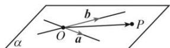
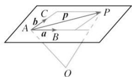

## 2. 平面的向量表示

如图, 设两条直线相交于点 O, 它们的方向向量分别为 $\vec{a}$ 和 $\vec{b}$ , P 为平面 $\alpha$ 内任意一点, 由平面向量基本定理可知, 存在唯一的有序实数对 $(x, y)$ , 使得 $\overrightarrow{OP} = x\vec{a} + y\vec{b}$ .

进一步地, 如图, 取定空间任意一点 O, 可以得到, 空间一点 P 位于平面 ABC 内的充要条件是存在实数 $(x, y)$ , 使 $\overrightarrow{OP} = \overrightarrow{OA} + x\overrightarrow{AB} + y\overrightarrow{AC}$ . 我们把该式称为空间平面 ABC 的向量表示式, 由此可知, 空间中任意平面由空间一点及两个不共线向量唯一确定.

