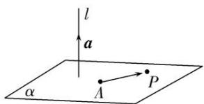

## 3. 平面的法向量定义

直线 $l \perp \alpha$ ，取直线 l 的方向向量 $\vec{a}$ ，我们称向量 $\vec{a}$ 为平面 $\alpha$ 的法向量。给定一个点 A 和一个向量 $\vec{a}$ ，那么过点 A，且以向量 $\vec{a}$ 为法向量的平面完全确定，可以表示为集合 $\left\{P \mid \vec{a} \cdot \overrightarrow{AP} = 0\right\}$ 。

注意:一个平面的法向量不是唯一的,在应用时,可适当取平面的一个法向量.已知一平面内两条相交直线的方向向量,可求出该平面的一个法向量.
