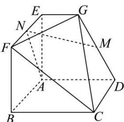

<!-- question-source:start -->
【15】（2024·长春）如图所示，在几何体 ABCDEFG 中，四边形 ABCD 和 ABFE 均为边长为 2 的正方形，AD // EG，AE ⊥ 底面 ABCD，M、N 分别为 DG、EF 的中点，EG = 1。求证：MN // 平面 CFG。

第四节 向量法研究直线、平面的位置关系
<!-- question-source:end -->

![[Q00005475A1]]
