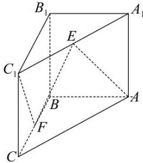

<!-- question-source:start -->
【16】（20-21 高二·全国课后作业）如图，在三棱柱 $ABC-A_{1}B_{1}C_{1}$ 中，侧棱垂直于底面， $AB \perp BC, E, F$ 分别为 $A_{1}C_{1}$ 和 BC 的中点. 求证： $C_{1}F \parallel$ 平面 ABE.

<!-- question-source:end -->

![[Q00005476A1]]
