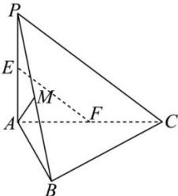

<!-- question-source:start -->
【20】如图, 在三棱锥 $P - ABC$ 中, $PA \perp$ 平面 $ABC$ , $AB \perp BC$ , $E, F, M$ 分别为 $AP, AC, PB$ 的中点, $PA = AB = BC = 1$ . 求证: $EF \perp AM$ .

<!-- question-source:end -->

![[Q00005480A1]]
