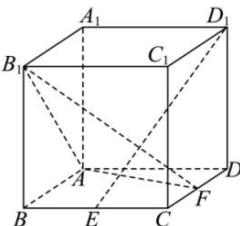

<!-- question-source:start -->
【21】(2023·北京朝阳高二)如图,在棱长为1的正方体 $ABCD-A_{1}B_{1}C_{1}D_{1}$ 中,点E、F分别为棱BC、CD中点.用空间向量法证明: $D_{1}E\perp$ 平面 $AB_{1}F$ .

第四节 向量法研究直线、平面的位置关系
<!-- question-source:end -->

![[Q00005481A1]]
