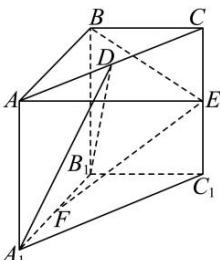

<!-- question-source:start -->
【27】（2024·全国）如图, 在直三棱柱 $ABC-A_{1}B_{1}C_{1}$ 中, 侧面 $ABB_{1}A_{1}$ 是正方形, AB=BC=2, D, E, F 分别为棱 $AC, CC_{1}, A_{1}B_{1}$ 的中点, 且 $BE \perp A_{1}B_{1}$ .

（1）求 $\overrightarrow{EF} \cdot \overrightarrow{BD}$ 的值；
(2) 用向量法证明: 平面 $BEA \perp$ 平面 $A_{1}B_{1}D$ .
<!-- question-source:end -->

![[Q00005637A1]]
