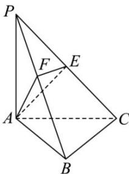

<!-- question-source:start -->
【33】如图, 在三棱锥 P-ABC 中, 侧棱 $PA \perp$ 底面 ABC, 且 $PA = AC = 2$ , $BC = 2\sqrt{2}$ , $AC \perp BC$ , 过棱 PC 的中点 E, 作 $EF \perp PB$ 交 PB 于点 F, 连接 AE, AF. 试确定点 F 的位置.

<!-- question-source:end -->

![[Q00005493A1]]
