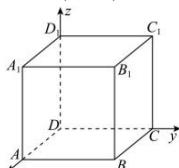

> [!faq]- 全练一本通解析
> **【答案】** 详见解析
>
> **【解析】**
> 如图建立空间直角坐标系,设正方体的棱长为1,则 $A(1,0,0)$ 、 $C(0,1,0)$ 、 $C_{1}(0,1,1)$ 、 $B_{1}(1,1,1)$ 、 $A_{1}(1,0,1)$ ,所以 $\overrightarrow{AC}=(-1,1,0)$ , $\overrightarrow{AB_{1}}=(0,1,1)$ , $\overrightarrow{AA_{1}}=(0,0,1)$ , 设面 $A_{1}ACC_{1}$ 的法向量为 $\vec{m}=(x,y,z)$ ，所以 $\left\{\begin{aligned}\vec{m}\cdot\overrightarrow{AC}&=-x+y=0\\ \vec{m}\cdot\overrightarrow{AA_{1}}&=z=0\end{aligned}\right.$ ，令 x=1，则 y=1，z=0，所以 $\vec{m}=(1,1,0)$ ，即平面 $A_{1}ACC_{1}$ 的一个法向量为 $\vec{m}=(1,1,0)$ ，设平面 $ACB_{1}$ 的法向量为 $\vec{n}=(a,b,c)$ ，则 $\left\{\begin{aligned}\vec{n}\cdot\overrightarrow{AC}&=-a+b=0\\ \vec{n}\cdot\overrightarrow{AB_{1}}&=b+c=0\end{aligned}\right.$ ，令 a=1，则 b=1，c=-1，所以 $\vec{n}=(1,1,-1)$ ，所以平面 $ACB_{1}$ 的一个法向量为 $\vec{n}=(1,1,-1)$ ;
> 
> 解析:(1)因为 x 轴垂直于平面 $ABB_{1}A_{1}$ ，所以 $\overline{n}_{1}=(1,0,0)$ 是平面 $ABB_{1}A_{1}$ 的一个法向量.
> （2）因为正方体 $ABCD-A_{1}B_{1}C_{1}D_{1}$ 的棱长为 3, $CM=2MC_{1}$ ,
> 所以 M, B, $D_{1}$ 的坐标分别为 $(0,3,2)$ , $(3,3,0)$ , $(0,0,3)$ ,
> 因此 $\overrightarrow{MB}=(3,0,-2)$ ， $\overrightarrow{MD_{1}}=(0,-3,1)$ 设 $\overrightarrow{n_{2}}=(x,y,z)$ 是平面 $MBD_{1}$ 的法向量，则 $\overrightarrow{n_{2}}\perp\overrightarrow{MB},\overrightarrow{n_{2}}\perp\overrightarrow{MD_{1}}$ 所以 $\left\{\begin{aligned}\overrightarrow{n_{2}}\cdot\overrightarrow{MB}&=3x-2z=0\\ \overrightarrow{n_{2}}\cdot\overrightarrow{MD_{1}}&=-3y+z=0\end{aligned}\right.$ 取 z=3，则 x=2，y=1。于是 $\overrightarrow{n_{2}}=(2,1,3)$ 是平面 $MBD_{1}$ 的一个法向量
