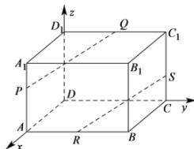

> [!faq]- 全练一本通解析
> **【答案】** 证明见解析
>
> **【解析】**
> 以点 D 为原点, 分别以 $\overrightarrow{DA}$ 、 $\overrightarrow{DC}$ 与 $\overrightarrow{DD_{1}}$ 的方向为 x、y 与 z 轴的正方向, 建立空间直角坐标系.
> 
> 则 $D(0,0,0)$ 、 $A(3,0,0)$ 、 $C(0,4,0)$ 、 $B(3,4,0)$ 、 $D_{1}(0,0,3)$ 、 $A_{1}(3,0,3)$ 、 $C_{1}(0,4,3)$ 、 $B_{1}(3,4,3)$ ，
> 由题意知 $P(3,0,2)$ 、 $Q(0,2,3)$ 、 $S(0,4,1)$ 、 $R(3,2,0)$ ,
> ∴ $\overline{PQ} = (-3,2,1)$ , $\overline{RS} = (-3,2,1)$ .
> ∴ $\overline{PQ} = \overline{RS}$ ，又 PQ，RS 不共线，
> ∴ $PQ \parallel RS$
