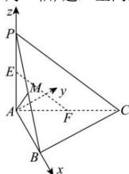

> [!faq]- 全练一本通解析
> **【答案】** 证为无解析
>
> **【解析】**
> 以 A 为原点, AB 为 x 轴, 过 A 且与 BC 平行的直线为 y 轴, AP 为 z 轴, 建立空间直角坐标系, 如图:
> 
> 则由题意得 $A(0,0,0)$ ， $P(0,0,1)$ ， $C(1,1,0)$ ， $B(1,0,0)$ ， $E\left(0,0,\frac{1}{2}\right),F\left(\frac{1}{2},\frac{1}{2},0\right),M\left(\frac{1}{2},0,\frac{1}{2}\right)$ $\overrightarrow{EF}=\left(\frac{1}{2},\frac{1}{2},-\frac{1}{2}\right),\overrightarrow{AM}=\left(\frac{1}{2},0,\frac{1}{2}\right)$ $\therefore \overrightarrow{EF} \cdot \overrightarrow{AM} = \frac{1}{2} \times \frac{1}{2} + 0 + \left(-\frac{1}{2}\right) \times \frac{1}{2} = 0$ ，即： $\overrightarrow{EF} \perp \overrightarrow{AM}$ ∴ $EF \perp AM$
