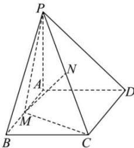

<!-- question-source:start -->
【22】(2024·安徽阜阳高二练习)如图, 已知 $PA \perp$ 平面 ABCD, 底面 ABCD 为正方形, PA = AD = AB = 2, M, N 分别为 AB, PC 的中点. 用空间向量法证明: $MN \perp$ 平面 PCD.

<!-- question-source:end -->

![[Q00005482A1]]
