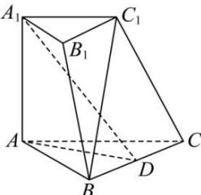

<!-- question-source:start -->
【23】（2023·全国高三专题练习）如图，在三棱台 $ABC-A_{1}B_{1}C_{1}$ 中， $\angle BAC=90^{\circ}$ ， $AA_{1}\perp$ 平面ABC，AB=AC=2， $A_{1}C_{1}=1$ ， $A_{1}A=\sqrt{3}$ ，且D为BC中点.用空间向量法证明： $BC\perp$ 平面 $A_{1}AD$ .

<!-- question-source:end -->

![[Q00005483A1]]
