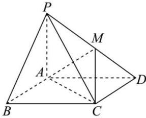

<!-- question-source:start -->
【25】（2024·四川成都高二期中）已知在四棱锥 P-ABCD 中，底面 ABCD 为正方形，侧棱 $PA \perp$ 平面 ABCD，点 M 为 PD 中点，PA = AD = 1。求证：平面 MAC $\perp$ 平面 PCD。

<!-- question-source:end -->

![[Q00005485A1]]
