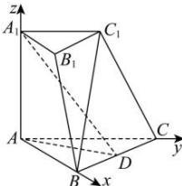

> [!faq]- 全练一本通解析
> **【答案】** 证明见解析
>
> **【解析】**
> 由题意, 以点 $A$ 为坐标原点, $AB$ , $AC$ , $AA_1$ 分别为 $x$ , $y$ , $z$ 轴, 建立空间直角坐标系,
> 
> 则 $A(0,0,0)$ , $A_{1}(0,0,\sqrt{3})$ , $B(2,0,0)$ , $C(0,2,0)$ , $D(1,1,0)$ ,
> 则 $\overrightarrow{BC}=(-2,2,0),\overrightarrow{AA_{1}}=(0,0,\sqrt{3}),\overrightarrow{AD}=(1,1,0)$ ,
> 故 $\overrightarrow{BC}\cdot\overrightarrow{AA_{1}}=-2\times0+2\times0+\sqrt{3}\times0=0,\therefore\overrightarrow{BC}\perp\overrightarrow{AA_{1}}$ $\overrightarrow{BC}\cdot\overrightarrow{AD}=-2\times1+2\times1+0\times0=0,\therefore\overrightarrow{BC}\perp\overrightarrow{AD}$ 即 $BC \perp AA_{1}, BC \perp AD$ 又 $AA_{1} \cap AD = A, AA_{1}, AD \subset$ 平面 $A_{1}AD$ 故 $BC \perp$ 平面 $A_{1}AD$ .
