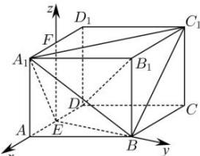

> [!faq]- 全练一本通解析
> **【答案】** 证明见解析
>
> **【解析】**
> 过点 E 作底面 ABCD 的垂线交 $A_{1}D_{1}$ 于 F，
> 以 E 为坐标原点，EA、EB、EF 所在直线分别为 x、y、z 轴，建立如图所示的空间直角坐标系，
> 
> 则 $A_{1}(1,0,\sqrt{2})$ , $C_{1}(-2,\sqrt{3},\sqrt{2})$ , $B(0,\sqrt{3},0)$ , $D(-1,0,0)$ , $B_{1}(0,\sqrt{3},\sqrt{2})$ ,
> 所以 $\overline{A_{1}C_{1}}=(-3,\sqrt{3},0)$ , $\overline{A_{1}B}=(-1,\sqrt{3},-\sqrt{2})$ , $\overline{DB_{1}}=(1,\sqrt{3},\sqrt{2})$ ,
> 因为 $\overline{A_{1}C_{1}}\cdot\overline{DB_{1}}=-3+3+0=0$ , $\overline{A_{1}B}\cdot\overline{DB_{1}}=-1+3-2=0$ ,
> 所以 $A_{1}C_{1}\perp DB_{1}, A_{1}B\perp DB_{1}$ ,
> 又 $A_{1}B\cap A_{1}C_{1}=A_{1}, A_{1}B, A_{1}C_{1}\subset$ 平面 $BA_{1}C_{1}$ ,
> 所以 $DB_{1}\perp$ 平面 $BA_{1}C_{1}$ .
