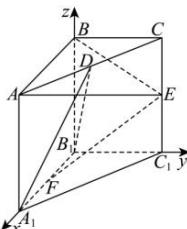

> [!faq]- 全练一本通解析
> **【答案】** （1） $\overrightarrow{EF}\cdot\overrightarrow{BD}=-1$ ；（2）证明见解析
>
> **【解析】**
> （1）在直三棱柱 ABC-A₁B₁C₁ 中，BB₁⊥A₁B₁，
> 又 BE⊥A₁B₁,BB₁∩BE=B,BB₁,BE⊂平面 BCC₁B₁，
> 所以 A₁B₁⊥平面 BCC₁B₁，因此 B₁A₁,B₁B₁,B₁C₁两两垂直.
> 建立如图所示的空间直角坐标系 B₁-xyz，
> 
> 则 $B(0,0,2), E(0,2,1), D(1,1,2), F(1,0,0)$ .
> 所以 $\overrightarrow{EF}=(1,-2,-1),\overrightarrow{BD}=(1,1,0)$ ,
> 所以 $\overrightarrow{EF}\cdot\overrightarrow{BD}=-1$
> （2）由（1）知 $A(2,0,2), A_1(2,0,0), \overline{BE} = (0,2,-1)$ ， $\overrightarrow{AE} = (-2,2,-1), \overrightarrow{A_1B_1} = (-2,0,0), \overrightarrow{A_1D} = (-1,1,2)$ ，
> 设平面 BEA 的法向量为 $\vec{n} = (x_1,y_1,z_1)$ ，平面 $A_1B_1D$ 的法向量为 $\vec{m} = (x_2,y_2,z_2)$ ，
> 则 $\left\{ \begin{array}{l} \overrightarrow{BE} \cdot \vec{n} = 0 \\ \overrightarrow{AE} \cdot \vec{n} = 0 \end{array} \right.$ ，即 $\left\{ \begin{array}{l} 2y_1 - z_1 = 0 \\ -2x_1 + 2y_1 - z_1 = 0 \end{array} \right.$ ，令 $y_1 = 1$ ，则 $\vec{n} = (0,1,2)$ ； $\left\{ \begin{array}{l} \overrightarrow{A_1B_1} \cdot \vec{m} = 0 \\ \overrightarrow{A_1D} \cdot \vec{m} = 0 \end{array} \right.$ ，即 $\left\{ \begin{array}{l} -2x_2 = 0, \\ -x_2 + y_2 + 2z_2 = 0, \end{array} \right.$ 令 $z_2 = 1$ ，则 $\vec{m} = (0,-2,1)$ ，所以 $\vec{m} \cdot \vec{n} = 0$ ，
> 所以平面 $BEA \perp$ 平面 $A_1B_1D$ 。
