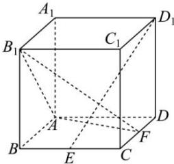

<!-- question-source:start -->
【28】（2022·广东肇庆高二阶段练习）在棱长为2的正方体 $ABCD - A_{1}B_{1}C_{1}D_{1}$ 中，点 $E$ 是 $BC$ 的中点，点 $F$ 是 $CD$ 上的动点.试确定点 $F$ 的位置，使得 $D_{1}E\perp$ 平面 $AB_{1}F$

<!-- question-source:end -->

![[Q00005488A1]]
