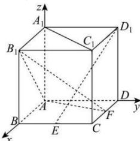

> [!faq]- 全练一本通解析
> **【答案】** F
>
> **【解析】**
> 为 CD 中点
> 解析：由于 $ABCD - A_1B_1C_1D_1$ 为正方体，以 $A$ 为坐标原点，分别以 $AB$ 、 $AD$ 、 $AA_1$ 所在直线为 $x$ 轴、 $y$ 轴、 $z$ 轴，建立如图所示的空间直角坐标系，
> 
> 所以 $D_{1}(0,2,2)$ ， $E(2,1,0)$ ， $A(0,0,0)$ ， $B_{1}(2,0,2)$ ，设 $F(t,2,0)$ ，所以 $\overrightarrow{D_{1}E}=(2,-1,-2)$ ， $\overrightarrow{AF}=(t,2,0)$ ， $\overrightarrow{AB_{1}}=(2,0,2)$ 设平面 $AB_{1}F$ 的法向量为 $\vec{n}=(x,y,z)$ ，则 $\left\{\begin{aligned}\overrightarrow{AF}\cdot\vec{n}&=0\\ \overrightarrow{AB_{1}}\cdot\vec{n}&=0\end{aligned}\right.$ ，即 $\left\{\begin{aligned}tx+2y&=0\\ 2x+2z&=0\end{aligned}\right.$ ，令 x=-2，则 $\left\{\begin{aligned}y=t\\ z=2\end{aligned}\right.$ ，即 $\vec{n}=(-2,t,2)$ ，
> 因为 $D_{1}E \perp$ 平面 $AB_{1}F$ ，则 $\vec{n}/\overline{D_{1}E}$ ，即 $\vec{n}=\lambda\overline{D_{1}E}$ ，解得 t=1，即 F 为 CD 中点时， $D_{1}E \perp$ 平面 $AB_{1}F$ .
