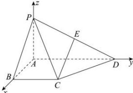

> [!faq]- 全练一本通解析
> **【答案】** 存在， $E$ 为 $PD$ 中点时， $CE / /$ 平面PAB，理由见解析.
>
> **【解析】**
> 由已知得以 $AB,AD,AP$ 两两垂直，分别以 $AB,AD,AP$ 为 $x,y,z$ 轴建立空间直角坐标系，如图.
> 
> $$
> \because P A = A B = B C = \frac {1}{2} A D = 1
> $$
> ∴ $P(0,0,1)$ , $C(1,1,0)$ , $D(0,2,0)$ ,
> 设 E (0, y, z)，则 $\overline{PE} = (0, y, z - 1)$ ， $\overline{PD} = (0, 2, -1)$ ，
> ∵E是棱PD上的点，
> ∴ $\overline{PE} \parallel \overline{PD}$ ，∴ $\frac{y}{2} = \frac{z - 1}{-1}$ ，即 $y = 2 - 2z$ ①
> ∵ $\overrightarrow{AD} = (0, 2, 0)$ 是平面 PAB 的法向量， $\overline{CE} = (-1, y - 1, z)$ ，
> ∴由 CE// 平面 PAB，可得 $\overline{CE} \perp \overline{AD}$ ，
> ∴ $(-1, y - 1, z) \cdot (0, 2, 0) = 2(y - 1) = 0$ ，
> ∴y=1，代入①式得 $z=\frac{1}{2}$ .
> ∴E是PD的中点，
> 此时，由于CE≠平面PAB，
> ∴CE//平面PAB.
> 故存在满足题意的点E，使得CE//平面PAB，且点E为棱PD的中点.
