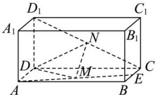

<!-- question-source:start -->
【32】（2024·湖北黄冈高二阶段练习）如图，在长方体 $ABCD-A_{1}B_{1}C_{1}D_{1}$ 中，E,M分别是BC，AE的中点， $AD=AA_{1}=1,AB=2$ 。若在线段 $CD_{1}$ 上存在一点N，使 $MN\parallel$ 平面 $ADD_{1}A_{1}$ ，试确定N的位置。

<!-- question-source:end -->

![[Q00005492A1]]
