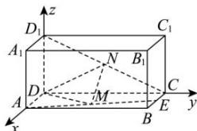

> [!faq]- 全练一本通解析
> **【答案】** N为 $CD_{1}$ 的中点
>
> **【解析】**
> 如图，分别以 DA，DC， $DD_{1}$ 所在直线为 x, y, z 轴建立空间直角坐标系，
> 则 $D(0,0,0)$ ， $A(1,0,0)$ ， $D_{1}(0,0,1)$ ， $C(0,2,0)$ ， $E\left(\frac{1}{2},2,0\right)$ ， $M\left(\frac{3}{4},1,0\right)$ ，
> 所以 $\overrightarrow{DC} = (0, 2, 0)$ ， $\overrightarrow{DM} = \left(\frac{3}{4}, 1, 0\right)$ ， $\overrightarrow{CD_{1}} = (0, -2, 1)$ .
> 设 $\overrightarrow{CN} = \lambda \overrightarrow{CD_{1}} = \lambda (0, -2, 1) = (0, -2\lambda, \lambda)(0 < \lambda < 1)$ 则 $\overrightarrow{DN} = \overrightarrow{DC} + \overrightarrow{CN} = (0, 2, 0) + (0, -2\lambda, \lambda) = (0, 2 - 2\lambda, \lambda)$ $\overline{MN}=\overline{DN}-\overline{DM}=\left(-\frac{3}{4},1-2\lambda,\lambda\right)$ 由题意知 $\overrightarrow{DC}=(0,2,0)$ 是平面 $ADD_{1}A_{1}$ 的一个法向量，所以 $\overline{MN} \perp \overline{DC}$ ，即 $2(1-2\lambda)=0$ ，解得 $\lambda=\frac{1}{2}$ .
> 因为 MN ∅ 平面 $ADD_{1}A_{1}$ ，所以当 N 为 $CD_{1}$ 的中点时，MN // 平面 $ADD_{1}A_{1}$
> 
